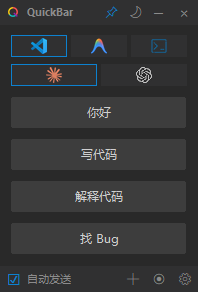
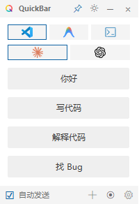

# QuickBar 🚀

QuickBar 是一款专为开发者设计的**极简、高效**的指令/提示词（Prompt）管理与自动化输入工具。它可以帮助你一键将常用的指令、代码片段或提示词发送到目标 IDE（如 VS Code）中的 AI 助手窗口或原生终端中。


<p align="center">
  
  &nbsp;&nbsp;&nbsp;&nbsp;
  
</p>
<p align="center"><em>深色主题 &nbsp;|&nbsp; 浅色主题</em></p>

## ✨ 核心特性

-   **🎯 跨工具支持**：预设支持 VS Code (Claude/Codex), Google Antigravity, 以及原生终端 (PowerShell/CMD)。
-   **⚡ 一键自动化**：通过图像识别（锚点匹配）技术，自动激活目标窗口、寻找输入框、粘贴并发送内容。
-   **🎨 现代美学设计**：
    -   无边框科技感界面，支持 **深色/浅色** 主题一键切换（可跟随系统主题）。
    -   支持透明度调节与**窗口置顶**。
    -   按钮列表圆角设计，支持**拖拽排序**。
    -   首次启动自动居中显示。
-   **🔧 智能自动化流程**：
    -   **两阶段校准**：简单的截图 + 点击即可适配任何分辨率下的 AI 输入框。
    -   **自动发送**：内容填入后可选是否自动按下回车（☑/☐ 复选框控制）。
    -   **焦点还原**：操作完成后自动将鼠标移回原位，不打断思路。
    -   校准时支持 **ESC 键** 或 **鼠标右键** 快速退出。
-   **📦 零配置上手**：
    -   单文件 EXE 绿色运行，无需安装 Python 环境。
    -   支持开机自启、最小化到托盘/任务栏、配置导入导出。
-   **🌐 多语言支持**：内置中文、英文、日文界面支持。

## 🚀 快速开始

### 方式一：直接运行 EXE（推荐）

1. 从 [Releases](https://github.com/your-repo/quickbar/releases) 下载最新版 `QuickBar.exe`
2. 双击运行即可

### 方式二：运行源代码

确保已安装 Python 3.10+，然后安装依赖：

```bash
pip install -r requirements.txt
```

运行程序：

```bash
python QuickBar.py
```

## 📖 使用指南

### 1. 选择目标
在顶部图标区域选择你正在使用的 IDE（如 VS Code）和对应的 AI 助手（如 Claude/Codex）。

### 2. 首次校准
点击底部的 🎯 校准按钮：
-   **步骤 1**：用鼠标框选输入框周围的一个特征点（如输入框图标或提示文字）。
-   **步骤 2**：在弹出的全屏遮罩中点击输入框的中心位置。
-   校准过程中可按 **ESC 键** 或 **鼠标右键** 取消。
-   提示文字会清晰显示在遮罩上方，并配有放大镜辅助定位。

### 3. 添加指令
点击底部的 ➕ 按钮添加新的指令：
-   **按钮名称**：显示在按钮上的简短标题（可留空自动截取）
-   **指令内容**：需要发送的完整文本

### 4. 发送内容
点击列表中的指令按钮，QuickBar 会自动：
1. 激活目标窗口
2. 定位输入框
3. 粘贴内容
4. （可选）自动按下回车发送

### 5. 管理指令
-   **拖拽排序**：长按指令按钮并拖动可调整顺序（拖拽时会显示蓝色横线指示器）
-   **编辑/删除**：右键点击指令按钮弹出菜单

## ⚙️ 设置选项

点击底部的 ⚙️ 设置按钮可配置：

| 选项 | 说明 |
|------|------|
| 列数 | 指令按钮显示列数（自动/1/2列） |
| 最小化位置 | 最小化到任务栏或系统托盘 |
| 关闭时最小化 | 点击关闭按钮时最小化而非退出 |
| 开机自启 | 系统启动时自动运行 |
| 主题跟随系统 | 自动跟随 Windows 深色/浅色模式 |
| 语言 | 中文/English/日本語 |
| 导入/导出配置 | 备份或迁移配置文件 |

## 🖼️ 图标资源

应用使用高分辨率 256×256 图标，确保在任务栏和系统托盘中清晰显示：

| 图标 | 用途 |
|------|------|
| Quickbar.png/ico | 应用主图标 |
| Vscode.png | VS Code |
| Claude.png | Claude AI |
| Codex.png | Codex AI |
| Antigravity.png | Google Antigravity |
| Terminal.png | 原生终端 |

## 🛠️ 技术实现

-   **GUI 框架**：Tkinter（经过深度定制，实现现代无边框 UI）
-   **自动化控制**：PyAutoGUI（鼠标键盘模拟）+ pywinauto（窗口定位与激活）
-   **图像处理**：Pillow（截图、锚点匹配、主题适配）
-   **系统托盘**：pystray（跨平台托盘支持）
-   **Windows API**：pywin32 + ctypes（窗口图标、任务栏集成、无边框窗口最小化）
-   **持久化**：JSON 文件存储指令和校准数据

## 📂 项目结构

```text
QuickBar/
├── QuickBar.py           # 主程序源代码 (~2000 行)
├── config.json           # 用户指令和应用状态配置（自动生成）
├── target_settings.json  # IDE/AI 校准偏移数据（自动生成）
├── requirements.txt      # Python 依赖列表
├── assets/               # 资源文件夹
│   ├── Quickbar.png/ico  # 应用图标 (256×256)
│   ├── Claude.png        # Claude AI 图标
│   ├── Codex.png         # Codex AI 图标
│   ├── Vscode.png        # VS Code 图标
│   ├── Antigravity.png   # Antigravity 图标
│   ├── Terminal.png      # 终端图标
│   └── anchors/          # 用户校准锚点图（自动生成）
└── dist/                 # 编译输出目录
    └── QuickBar.exe      # 编译后的可执行文件 (~66MB)
```

## 📋 依赖项

```
pyautogui
pyperclip
pillow
pywinauto
pystray
pywin32
```

## 🔨 编译说明

使用 PyInstaller 编译为单文件 EXE：

```bash
pip install pyinstaller
pyinstaller --noconfirm --onefile --windowed --name=QuickBar --icon=assets/Quickbar.ico --add-data "assets;assets" QuickBar.py
```

编译后的文件位于 `dist/QuickBar.exe`。

## 🐛 常见问题

### Q: 校准后点击按钮没有反应？
A: 尝试重新校准。确保校准时选择的特征点在目标应用中始终可见。


## 📝 更新日志

### v1.1.0 (2025-12-22)
- ✅ 更新所有图标为 256×256 高分辨率版本
- ✅ 首次启动时窗口自动居中显示
- ✅ 校准提示文字显示在遮罩上方（更清晰）
- ✅ 自动发送复选框改为 ☑/☐ 样式
- ✅ 拖拽指示器改为 3px 横线
- ✅ 修复最小化按钮（支持无边框窗口）
- ✅ 校准支持 ESC 键和鼠标右键退出
- ✅ 优化任务栏图标大小和清晰度
- ✅ 完善“检查更新”功能，支持从 GitHub 获取最新版本
- ✅ 新增“启动时检查更新”设置选项

### v1.0.0 (2025-12-22)
- ✅ 首次开源发布
- ✅ 支持 VS Code + Claude/Codex/Antigravity
- ✅ 支持原生终端 (PowerShell/CMD)
- ✅ 两阶段校准（截图 + 点击）
- ✅ 深色/浅色主题，支持跟随系统
- ✅ 拖拽排序指令按钮
- ✅ 最小化到任务栏/托盘
- ✅ 多语言支持（中/英/日）

## 🤝 贡献与反馈

欢迎提交 Issue 或 Pull Request 来改进 QuickBar！

## 📄 许可证

MIT License

---
*保持专注，让 Prompt 随手即得。* ⚡
